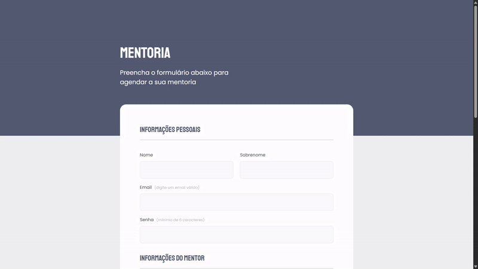

# Projeto 03 Desafio - Mentoria

> Este projeto é uma página web com Formulários que contém validações dentro do HTML, usando HTML e CSS. Ele é um desafio proposto pela Rocketseat com intuito do aluno aplicar o conhecimento obtido durante certo período do curso.

## Funcionalidades

- Input's customizados
- Botão customizado
- Formulário com data e hora
- Validações simples

## Aprendizados

- Input's e Form
- Fieldset junto do Legend
- Validações dentro HTML
- Customização de SELECT

## Stack utilizada

**Front-end:** HTML, CSS

